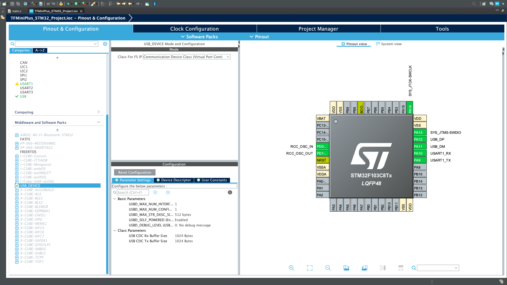

# TFMini Plus STM32 Project

## About the Project
This project aims to program the TFMini Plus sensor with the STM32F103C8T6 microcontroller and display the data from the sensor on the minicom terminal.

## Requirements
- STM32F103C8T6 microcontroller
- TFMini Plus sensor
- STM32CubeIDE
- minicom terminal program (or another terminal emulator)

## Installation
1. Open the project with **STM32CubeIDE** and build it.
2. Don't forget true clock configuration.(I shared picture)
2. Upload the code to the microcontroller.
3. Open the **minicom** terminal and configure the appropriate serial port settings.
4. View the data from the sensor on the minicom terminal.

## TF Mini Plus Connection
Project codes use Usart1 as communucation port to connect to TF Mini Plus. Connection is as follow:
| TF Mini Plus   |  Board |
|----------------|--------|
|Red cable(+5V)  | +5V    |
|Green cable(TX) |PA10(RX)|
|White cable(RX) | PA9(TX)|
|Black cable(GND)|  GND   |

## TF Mini Plus Configuration
1- Open Pinout & Configuration --> System core --> select RCC --> High Speed Clock (HSE) --> Crystal/Ceramic Resonator and Low Speed Clock (LSE) --> Disable


2- Pinout & Configuration --> System core --> select SYS --> Debug --> Serial Wire --> Timebase Source --> SysTick


3- Pinout & Configuration --> Connectivity --> select USART1 --> Mode --> Asynchronous


4- Pinout & Configuration --> Connectivity --> select USB --> Active Device (FS)


5- Pinout & Configuration --> Middleware and Software Packs --> USB_DEVICE --> Active Device --> Class For FS IP --> Communication Device Class



6- Open Clock Configuration --> Make arrangements as shown


## TF Mini Plus Read Distance Code
```c
int read_distance(UART_HandleTypeDef *huart, uint16_t *distance) {
    uint8_t rx_buffer[9];
    HAL_StatusTypeDef status = HAL_UART_Receive(huart, rx_buffer, 9, 1000);
    if (status == HAL_OK) {
        for (int i = 0; i < 7; i++) {
            if (rx_buffer[i] == 0x59 && rx_buffer[i+1] == 0x59) {
                *distance = (rx_buffer[i+3] << 8) | rx_buffer[i+2];
                return 0;
            }
        }
    } else {
        char error_msg[64];
        sprintf(error_msg, "HAL_UART_Receive failed: %d\r\n", status);
        CDC_Transmit_FS((uint8_t*)error_msg, strlen(error_msg));
    }
    return -1;
}
```
### Function Overview:
This function is designed to read distance data from a UART communication interface, typically used with sensors like TF Mini Plus LIDAR sensors.

### Parameters:
- `UART_HandleTypeDef *huart` : Pointer to a UART handle structure, specifying which UART peripheral and configuration to use.
- `uint16_t *distance` :  Pointer to a variable where the distance data (in millimeters) will be stored.

### Function Logic:
1. Data Reception:

    `HAL_StatusTypeDef status = HAL_UART_Receive(huart, rx_buffer, 9, 1000);`
    
    - `HAL_UART_Receive` is a HAL library function used to receive data over UART.
    - It attempts to receive 9 bytes (`rx_buffer`) from the UART peripheral specified by `huart`.
    - It waits for data for up to 1000 milliseconds (`1 second`).
2. Data Reception Status Check:
    
    `if (status == HAL_OK) `

    - Checks if data reception was successful (HAL_OK).
    - Proceeds to process the received data if successful.
3. Data Processing:

```c
for (int i = 0; i < 7; i++) {
    if (rx_buffer[i] == 0x59 && rx_buffer[i+1] == 0x59) {
        *distance = (rx_buffer[i+3] << 8) | rx_buffer[i+2];
        return 0;
    }
}
```
- Iterates through the received `rx_buffer` (up to 7 bytes, checking for the start pattern `0x59 0x59`).
- When the start pattern is found, extracts the distance data stored in the next bytes (`rx_buffer[i+2]` and `rx_buffer[i+3]`).
- Combines these bytes to form a 16-bit unsigned integer (`uint16_t`), representing the distance in millimeters.
- Stores this value in the memory location pointed to by `distance`.

4. Error Handling:
```c
} else {
    char error_msg[64];
    sprintf(error_msg, "HAL_UART_Receive failed: %d\r\n", status);
    CDC_Transmit_FS((uint8_t*)error_msg, strlen(error_msg));
}
```
- If `HAL_UART_Receive` fails (status is not `HAL_OK`), it creates an error message.
- Uses `sprintf` to format an error message string (`error_msg`) including the status code.
- Sends the error message via USB CDC (Communication Device Class) using `CDC_Transmit_FS`.

- `strlen(error_msg)` determines the length of the error message to transmit.

5. Return:
`return -1;`
- Returns -1 to indicate an error occurred during data reception or processing.

### Summary:
This function encapsulates the process of receiving and parsing distance data from a UART-connected sensor. It handles successful data reception by searching for a specific start pattern (`0x59 0x59`) and extracting the subsequent bytes to calculate and store the distance value. If there's an error in data reception, it transmits an error message over USB CDC.

## Usage
- Compile the code and upload it to the microcontroller.
- Start the minicom terminal.
- Observe the data coming from the sensor via the serial port.


## Contributing
If you would like to contribute, you can do so by sending a pull request.

## License
This project is licensed under the MIT License.

